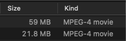

# ffmpeg-videocompress-entire-directory
A shell script will automate the whole process of video or audio file compression

### Demo:
Sneakpeak of ffmpeg video compression.




## Using Homebrew
The simplest way to install ffmpeg on Mac OS X is with [Homebrew](http://mxcl.github.com/homebrew/).

Once you have Homebrew installed install ffmpeg from the Terminal with the following:
```
$ brew install ffmpeg
```

You're done!

### Steps:

- `ffmpeg-script.sh` file should be in the parent directory, that parent directory contains `videos/ or original folder` and `compressed/ or output folder`

- paste on terminal `chmod +x ffmpeg-script.sh`

- run `./ffmpeg-script.sh`

Curious to see what inside the shell file?
```bash
for f in videos/*mp4; 
  do ffmpeg -i "$f" "compressed/${f##*/}"; 
done
```

Convert any type of video file to mkv, you can use:
```bash
for f in videos/*;
  do ffmpeg -i "$f" "compressed/$(basename "${f%.*}").mkv";
done
```

In the above examples:

- `${var##*/}` will outputs all characters after the last slash `/`, so only the filename without the path will remains;
- `${f%.*}` will outputs all characters before the last dot, so the path and the filename will be kept but the file extension will be removed. Then the command substitution `$(basename "/path/name")` will outputs only the name without the path.

**Resources:**
- [ASK UBUNTU](https://askubuntu.com/questions/1172233/batch-compress-videos-with-ffmpeg)
- [StackOverFlow](https://stackoverflow.com/questions/5784661/how-do-you-convert-an-entire-directory-with-ffmpeg)
- [StackOverFlow](https://stackoverflow.com/questions/125281/how-do-i-remove-the-file-suffix-and-path-portion-from-a-path-string-in-bash/125340#125340)
